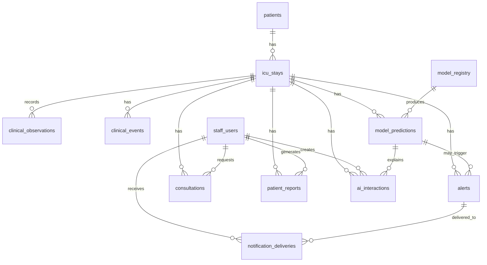

# ClinSight V4 DB 스키마 문서

## 0. 기준 및 범위

| 항목 | 내용 |
|---|---|
| 기준 아키텍처 | ClinSight 아키텍처 구축 사양서 V4 최종 종합본 |
| DB 최종 구조 | Aurora PostgreSQL 1개 DB + 14개 핵심 테이블 + View/Materialized View |
| 기본 제외 | DynamoDB, DynamoDB Streams |
| 기본 이벤트 처리 | SQS + EventBridge + 애플리케이션 레벨 이벤트 발행 |
| 예측 처리 방식 | EMR Agent가 임상 데이터를 전송하면 비동기로 예측을 미리 계산하고, 대시보드는 Aurora에 저장된 최신 예측 결과를 조회 |
| 데이터 전제 | 교육/연구용 구현은 MIMIC-IV 기반 비식별 데이터 사용. 실제 병원 적용 시 법무·정보보호·보안 담당 검토 필요 |

## 1. 설계 원칙

| 원칙 | 설명 |
|---|---|
| 환자 원본 식별정보는 저장하지 않음 | 환자명, 주민등록번호, 연락처, 주소, MRN 같은 직접 식별정보는 Main VPC/Aurora에 저장하지 않는다. |
| token 중심 식별 | 병원 내부 Agent가 생성한 `patient_token`, `stay_token`을 기준으로 환자와 ICU 체류를 연결한다. |
| 시간은 `TIMESTAMPTZ` 사용 | Agent는 ISO8601 + timezone offset으로 보내고, Aurora에는 UTC 기준으로 저장한다. 화면에서는 프론트엔드가 사용자 로컬 시간으로 변환한다. |
| 임상 시계열은 하나의 테이블로 통합 | vital, lab, SOFA, derived metric은 `clinical_observations`에 통합한다. |
| 예측 결과는 이력형 테이블로 저장 | 최신 결과만 덮어쓰지 않고, `model_predictions`에 시간별 예측 이력을 남긴다. |
| 대시보드는 View/Materialized View로 최적화 | 대시보드용 최신 상태는 원본 테이블을 중복 저장하지 않고 `mv_active_patient_dashboard` 중심으로 구성한다. |
| 큰 payload는 S3에 저장 | feature snapshot, 큰 SHAP payload, 보고서 파일, 감사 archive는 S3에 두고 Aurora에는 URI pointer만 저장한다. |
| 설정성 데이터는 `config_items`로 통합 | 부서, ICU unit, 지표 정의, 알림 규칙, 권한 설정처럼 lookup 성격이 강한 데이터는 `config_items`에 저장한다. |
| 감사 로그는 업무 데이터와 분리 | 사용자의 조회/수정/AI 요청/Agent 전송 기록은 `audit_logs`에 별도로 저장한다. |

## 2. 용어 정리

| 용어 | 쉬운 설명 | DB에서 주로 쓰이는 위치 |
|---|---|---|
| ICU stay | 환자가 중환자실에 머문 한 번의 기간. 같은 환자가 여러 번 ICU에 입실할 수 있다. | `icu_stays` |
| vital | 혈압, 맥박, 체온, 산소포화도처럼 환자 상태를 자주 측정하는 생체징후 | `clinical_observations` |
| lab | 혈액검사, 염증 수치, 간/신장 기능 검사처럼 검사실에서 나온 수치 | `clinical_observations` |
| SOFA | 장기 기능 저하 정도를 보는 점수. 패혈증 환자 중증도 판단에 자주 사용된다. | `clinical_observations(metric_group='sofa')` |
| derived metric | 원본 수치를 조합해서 만든 지표. 예: PaO2/FiO2 ratio | `clinical_observations` |
| SHAP | 모델 예측에 어떤 feature가 얼마나 영향을 줬는지 설명하는 값 | `model_predictions`, `ai_interactions`, S3 |
| alert | 위험도 상승, 예측 결과 변화, 임상 기준 충족 등으로 의료진에게 보여주는 알림 | `alerts`, `notification_deliveries` |
| Materialized View | 쿼리 결과를 미리 저장해두는 View. 대시보드처럼 자주 조회하는 화면을 빠르게 만들 때 사용한다. | `mv_active_patient_dashboard` 등 |

## 3. 전체 테이블 요약

| # | 테이블 | 핵심 역할 | 주요 기준 ID |
|---:|---|---|---|
| 1 | `patients` | 비식별 환자 마스터 | `patient_id`, `patient_token` |
| 2 | `icu_stays` | ICU 체류 기준 엔티티 | `stay_id`, `stay_token`, `patient_id` |
| 3 | `staff_users` | 의료진 사용자와 권한 | `staff_id`, `cognito_sub` |
| 4 | `clinical_observations` | vital, lab, SOFA, derived metric 통합 시계열 | `observation_id`, `stay_id` |
| 5 | `clinical_events` | 오더, 예정 이벤트, 병상 이동, 타임라인성 이벤트 | `event_id`, `stay_id` |
| 6 | `model_registry` | 모델 버전, endpoint, artifact, feature schema 관리 | `model_id`, `model_key`, `model_version` |
| 7 | `model_predictions` | 모델 예측 결과와 예측 이력 | `prediction_id`, `stay_id`, `model_id` |
| 8 | `alerts` | 알림 발생/확인/해소 상태 | `alert_id`, `stay_id` |
| 9 | `notification_deliveries` | 의료진별 알림 전달/읽음/확인 상태 | `delivery_id`, `alert_id`, `staff_id` |
| 10 | `consultations` | 협진 요청, 수신자, 노트, 상태 이력 | `consultation_id`, `stay_id` |
| 11 | `patient_reports` | 환자 보고서 메타데이터와 S3 파일 pointer | `report_id`, `stay_id` |
| 12 | `ai_interactions` | AI insight cache, chat session, chat message 통합 | `interaction_id`, `stay_id` |
| 13 | `audit_logs` | 사용자/API/Agent 감사 로그 | `audit_id` |
| 14 | `config_items` | 부서, ICU unit, 지표 정의, 알림 규칙, 권한 설정 | `config_id`, `config_type`, `config_key` |

## 4. 관계 요약



---

# 5. 테이블별 상세 스키마

## 5.1 `patients`

### 역할

`patients`는 비식별 환자 마스터 테이블이다. 실제 환자명, MRN, 주민등록번호, 주소, 연락처, 생년월일 원문은 저장하지 않는다. 같은 환자가 여러 번 ICU에 입실할 수 있으므로 `icu_stays`와 분리한다.

### 주요 사용 화면/API

| 사용처 | 설명 |
|---|---|
| 환자 상세 헤더 | 환자의 비식별 기본 정보 표시 |
| ICU 대시보드 | 환자 카드의 성별/연령대 표시 |
| 예측/알림/보고서 | `icu_stays`를 통해 환자 단위로 연결 |

### 컬럼

| 컬럼 | 타입 | Null | Key | 기본값 | 설명 |
|---|---|---:|---|---|---|
| `patient_id` | `UUID` | N | PK | `gen_random_uuid()` | Aurora 내부 환자 PK |
| `patient_token` | `TEXT` | N | UK |  | 병원 내부 Agent가 생성한 비식별 환자 토큰 |
| `sex` | `TEXT` | Y |  |  | 성별. 예: `M`, `F`, `UNKNOWN` |
| `age_years` | `INT` | Y |  |  | 나이. 실제 생년월일 대신 나이만 저장 |
| `age_group` | `TEXT` | Y |  |  | 연령대. 예: `50s`, `60s`, `90+` |
| `source_system` | `TEXT` | Y |  |  | 데이터 출처. 예: `mimic`, `mock_emr` |
| `source_patient_hash` | `TEXT` | Y |  |  | 원본 환자 ID를 직접 저장하지 않고 hash로 추적할 때 사용 |
| `metadata_jsonb` | `JSONB` | Y |  |  | 교육용 cohort 정보 등 부가 메타데이터 |
| `created_at` | `TIMESTAMPTZ` | N |  | `now()` | 생성 시각 |
| `updated_at` | `TIMESTAMPTZ` | N |  | `now()` | 수정 시각 |

### 인덱스

| 인덱스 | 컬럼 | 목적 |
|---|---|---|
| `pk_patients` | `patient_id` | PK 조회 |
| `uk_patients_patient_token` | `patient_token` | token 기반 환자 단건 조회 |

### 설계 메모

- 실제 병원 적용 시 환자 실명과 token 매핑은 병원 내부 시스템에 남아야 한다.
- Main VPC/Aurora에는 직접 식별정보를 저장하지 않는 것을 기본 원칙으로 한다.
- `patient_token`은 API 응답에 사용할 수 있지만, 외부 노출 가능성을 고려해 권한과 감사 로그를 함께 둔다.

---

## 5.2 `icu_stays`

### 역할

`icu_stays`는 ClinSight의 가장 중요한 기준 엔티티다. 대시보드, 환자 상세, 임상 수치, 예측 결과, 알림, 협진, 보고서가 모두 ICU 체류 단위로 연결된다. `admissions`, `icu_units`, `beds`, `bed_assignments`는 V4에서 이 테이블과 `clinical_events`, `config_items`로 흡수한다.

### 주요 사용 화면/API

| 사용처 | 설명 |
|---|---|
| `GET /dashboard/icu/{icuId}` | ICU별 현재 입실 환자 목록 조회 |
| `GET /icu-stays/{stayId}` | 환자 상세 헤더 조회 |
| `GET /icu-stays/{stayId}/clinical-data` | 해당 ICU 체류의 임상 수치 조회 |
| `GET /icu-stays/{stayId}/predictions` | 해당 ICU 체류의 예측 결과 조회 |
| `GET /icu-stays/{stayId}/timeline` | 해당 ICU 체류의 타임라인 조회 |

### 컬럼

| 컬럼 | 타입 | Null | Key | 기본값 | 설명 |
|---|---|---:|---|---|---|
| `stay_id` | `UUID` | N | PK | `gen_random_uuid()` | Aurora 내부 ICU stay PK |
| `stay_token` | `TEXT` | N | UK |  | 병원 내부 Agent가 생성한 비식별 ICU stay 토큰 |
| `patient_id` | `UUID` | N | FK |  | `patients.patient_id` |
| `patient_token` | `TEXT` | N |  |  | 조회 편의를 위한 비정규화 token |
| `admission_token` | `TEXT` | Y |  |  | 비식별 입원 token |
| `admission_type` | `TEXT` | Y |  |  | 입원 유형. 예: emergency, elective |
| `primary_diagnosis_code` | `TEXT` | Y |  |  | 주 진단 코드. 예: ICD 계열 코드 |
| `primary_diagnosis_text` | `TEXT` | Y |  |  | 화면 표시용 비식별 진단 설명 |
| `hospital_admit_at` | `TIMESTAMPTZ` | Y |  |  | 병원 입원 시각 |
| `hospital_discharge_at` | `TIMESTAMPTZ` | Y |  |  | 병원 퇴원 시각 |
| `icu_in_at` | `TIMESTAMPTZ` | N |  |  | ICU 입실 시각 |
| `icu_out_at` | `TIMESTAMPTZ` | Y |  |  | ICU 퇴실 시각 |
| `sepsis_onset_at` | `TIMESTAMPTZ` | Y |  |  | 패혈증 onset 기준 시각. 모델 cohort 기준에 사용 |
| `current_unit_code` | `TEXT` | Y | IDX |  | 현재 ICU unit 코드. 상세 정의는 `config_items(config_type='icu_unit')` |
| `current_bed_label` | `TEXT` | Y |  |  | 현재 병상 표시명. 예: `ICU-A-03` |
| `status` | `TEXT` | N | IDX | `'active'` | `active`, `discharged`, `expired`, `transferred` 등 |
| `severity_summary_jsonb` | `JSONB` | Y |  |  | 대시보드 표시용 중증도 요약. 예: 최근 SOFA, 주요 flag |
| `metadata_jsonb` | `JSONB` | Y |  |  | cohort, MIMIC 원천 정보 등 부가정보 |
| `created_at` | `TIMESTAMPTZ` | N |  | `now()` | 생성 시각 |
| `updated_at` | `TIMESTAMPTZ` | N |  | `now()` | 수정 시각 |

### 인덱스

| 인덱스 | 컬럼 | 목적 |
|---|---|---|
| `pk_icu_stays` | `stay_id` | PK 조회 |
| `uk_icu_stays_stay_token` | `stay_token` | token 기반 단건 조회 |
| `idx_icu_stays_patient_time` | `patient_id`, `icu_in_at DESC` | 환자별 ICU 체류 이력 조회 |
| `idx_icu_stays_unit_status` | `current_unit_code`, `status` | ICU 대시보드 현재 환자 목록 조회 |

### 설계 메모

- `stay_id`는 DB 내부 PK이고, `stay_token`은 외부 Agent/API 흐름에서 쓰기 쉬운 비식별 token이다.
- `patient_token`은 조회 편의를 위한 비정규화 컬럼이다. `icu_stays` INSERT 시 `ClinicalIngestionLambda` 또는 초기 적재 스크립트가 `patients.patient_token` 값을 복사해 채워주며, token 생성 이후에는 변경하지 않는 것을 원칙으로 한다.
- 환자 1명은 여러 ICU stay를 가질 수 있으므로 `patients`와 합치지 않는다.
- 병상 이동 이력은 `clinical_events(event_type='bed_transfer')`로 남기고, 현재 표시용 병상만 `icu_stays.current_bed_label`에 둔다.

---

## 5.3 `staff_users`

### 역할

`staff_users`는 의료진 사용자와 권한 정보를 저장한다. V4 기본 인증은 Cognito 기반 JWT이며, 이 테이블은 Cognito에서 인증된 사용자가 ClinSight 내부에서 어떤 역할과 부서 권한을 갖는지 관리한다.

### 주요 사용 화면/API

| 사용처 | 설명 |
|---|---|
| `GET /me` | 현재 로그인한 사용자 정보 조회 |
| 협진 | 요청자/수신자 의료진 정보 표시 |
| 알림 | 의료진별 알림 전달 상태 연결 |
| 보고서 | 보고서 생성자 연결 |
| 감사 로그 | actor 정보 연결 |

### 컬럼

| 컬럼 | 타입 | Null | Key | 기본값 | 설명 |
|---|---|---:|---|---|---|
| `staff_id` | `UUID` | N | PK | `gen_random_uuid()` | 내부 의료진 PK |
| `cognito_sub` | `TEXT` | N | UK |  | Cognito User Pool subject |
| `staff_code` | `TEXT` | Y | UK |  | 병원 내부 직원 코드. 실제 운영에서는 보안 검토 필요 |
| `display_name` | `TEXT` | Y |  |  | 화면 표시용 이름 또는 별칭 |
| `work_email` | `TEXT` | Y |  |  | 업무용 이메일. 필요 시 저장 |
| `role` | `TEXT` | N | IDX |  | `physician`, `nurse`, `admin` 등 |
| `primary_department_code` | `TEXT` | Y | IDX |  | 주 소속 부서 코드. 부서 정의는 `config_items` |
| `roles_jsonb` | `JSONB` | Y |  |  | 복수 역할/세부 권한이 필요할 때 사용 |
| `permissions_jsonb` | `JSONB` | Y |  |  | 사용자별 권한 override가 필요할 때 사용 |
| `current_shift_jsonb` | `JSONB` | Y |  |  | 현재 근무조 표시용 정보 |
| `status` | `TEXT` | N |  | `'active'` | `active`, `inactive`, `suspended` 등 |
| `last_login_at` | `TIMESTAMPTZ` | Y |  |  | 마지막 로그인 시각 |
| `created_at` | `TIMESTAMPTZ` | N |  | `now()` | 생성 시각 |
| `updated_at` | `TIMESTAMPTZ` | N |  | `now()` | 수정 시각 |

### 인덱스

| 인덱스 | 컬럼 | 목적 |
|---|---|---|
| `pk_staff_users` | `staff_id` | PK 조회 |
| `uk_staff_users_cognito_sub` | `cognito_sub` | JWT subject 기반 사용자 조회 |
| `idx_staff_users_department_role` | `primary_department_code`, `role` | 부서/역할별 의료진 목록 조회 |

### 설계 메모

- V4에서는 `staff_department_memberships`, `staff_shifts`를 별도 테이블로 두지 않고 컬럼/JSONB로 축소한다.
- 실제 병원 연동 시에는 병원 IdP/SSO의 권한 체계와 동기화하는 방식을 검토한다.
- 환자 개인정보와 달리 의료진 정보는 업무 시스템 운영상 일부 저장될 수 있으나, 최소한의 업무 정보만 저장하는 것을 권장한다.

---

## 5.4 `clinical_observations`

### 역할

`clinical_observations`는 vital, lab, SOFA, derived metric을 통합하는 가장 큰 시계열 테이블이다. 모델 feature window 조회, 환자 상세 trend 그래프, SOFA trend, 대시보드 요약의 원천 데이터가 된다.

### 주요 사용 화면/API

| 사용처 | 설명 |
|---|---|
| `GET /icu-stays/{stayId}/clinical-data` | vital/lab trend 조회 |
| `GET /icu-stays/{stayId}/sofa` | SOFA 점수 trend 조회 |
| PredictionWorkerLambda | feature window 조회 |
| 대시보드 Materialized View | 최근 vital/lab/SOFA 요약 |

### 컬럼

| 컬럼 | 타입 | Null | Key | 기본값 | 설명 |
|---|---|---:|---|---|---|
| `observation_id` | `UUID` | N | PK | `gen_random_uuid()` | 임상 관측값 PK |
| `stay_id` | `UUID` | N | FK/IDX |  | `icu_stays.stay_id` |
| `stay_token` | `TEXT` | N | IDX |  | Agent/API 처리 편의를 위한 token |
| `patient_id` | `UUID` | Y | FK |  | 조회 편의를 위한 환자 ID. `stay_id`로도 추론 가능 |
| `metric_group` | `TEXT` | N | IDX |  | `vital`, `lab`, `sofa`, `derived`, `ventilation` 등 |
| `metric_code` | `TEXT` | N | IDX |  | 지표 코드. 예: `hr`, `map`, `lactate`, `sofa_total` |
| `metric_name` | `TEXT` | Y |  |  | 화면 표시명. 정의는 `config_items(config_type='metric_definition')`와 연결 가능 |
| `numeric_value` | `NUMERIC` | Y |  |  | 수치형 값 |
| `text_value` | `TEXT` | Y |  |  | 수치가 아닌 값. 예: 산소공급 방식 |
| `unit` | `TEXT` | Y |  |  | 단위. 예: `mmHg`, `mg/dL`, `score` |
| `value_status` | `TEXT` | Y |  |  | `normal`, `high`, `low`, `critical`, `unknown` 등 |
| `normal_range_low` | `NUMERIC` | Y |  |  | 정상 범위 하한 |
| `normal_range_high` | `NUMERIC` | Y |  |  | 정상 범위 상한 |
| `observed_at` | `TIMESTAMPTZ` | N | IDX |  | 실제 측정/발생 시각 |
| `recorded_at` | `TIMESTAMPTZ` | Y |  |  | EMR에 기록된 시각. 측정 시각과 다를 수 있음 |
| `source_system` | `TEXT` | Y |  |  | `mock_emr`, `mimic`, `lis`, `vital_monitor` 등 |
| `source_record_id_hash` | `TEXT` | Y |  |  | 원본 record id hash |
| `batch_id` | `TEXT` | Y |  |  | Agent 중복 적재 방지용 batch/idempotency key |
| `quality_flag` | `TEXT` | Y |  |  | `valid`, `suspect`, `missing`, `imputed` 등 |
| `metadata_jsonb` | `JSONB` | Y |  |  | 원천 코드, 장비 정보, 파생 지표 계산 정보 등 |
| `created_at` | `TIMESTAMPTZ` | N |  | `now()` | 생성 시각 |

### 인덱스

| 인덱스 | 컬럼 | 목적 |
|---|---|---|
| `pk_clinical_observations` | `observation_id` | PK 조회 |
| `idx_obs_stay_metric_time` | `stay_id`, `metric_code`, `observed_at DESC` | 특정 환자/지표 trend 조회 |
| `idx_obs_stay_time` | `stay_id`, `observed_at DESC` | 환자 타임라인/feature window 조회 |
| `idx_obs_sofa_stay_time` | `stay_id`, `observed_at DESC` WHERE `metric_group='sofa'` | SOFA trend 조회 최적화 |
| `idx_obs_batch_id` | `batch_id` | Agent batch 추적 및 중복 확인 |

### 파티셔닝

| 항목 | 값 |
|---|---|
| 파티션 기준 | `observed_at` |
| 권장 방식 | 월 단위 Range Partition |
| 이유 | 데이터량이 가장 많고 시간 범위 조회가 많다. 오래된 partition archive/export가 쉽다. |

### 설계 메모

- `sofa_scores`는 별도 테이블로 두지 않고 `metric_group='sofa'`로 흡수한다.
- 모델 feature로 쓰이는 값은 `observed_at` 기준으로 feature window를 자른다.
- 측정 시각과 기록 시각이 다를 수 있으므로 `observed_at`과 `recorded_at`을 분리한다.
- 수치값이 아닌 산소공급 방식, 이벤트성 측정값은 `text_value`와 `metadata_jsonb`를 함께 사용한다.

---

## 5.5 `clinical_events`

### 역할

`clinical_events`는 오더, 예정 이벤트, 병상 이동, 주요 임상 이벤트처럼 “시점이 있는 사건”을 저장한다. 환자 상세 타임라인과 일정 화면의 원천이 된다.

### 주요 사용 화면/API

| 사용처 | 설명 |
|---|---|
| `GET /icu-stays/{stayId}/timeline` | 과거 이벤트 타임라인 조회 |
| `GET /icu-stays/{stayId}/schedule` | 예정 검사/처치/협진 일정 조회 |
| ScheduledEventBuilderLambda | 오더 기반 예정 이벤트 생성 |
| AlertEvaluatorLambda | 특정 이벤트 발생 여부 기반 알림 평가 |

### 컬럼

| 컬럼 | 타입 | Null | Key | 기본값 | 설명 |
|---|---|---:|---|---|---|
| `event_id` | `UUID` | N | PK | `gen_random_uuid()` | 임상 이벤트 PK |
| `stay_id` | `UUID` | N | FK/IDX |  | `icu_stays.stay_id` |
| `stay_token` | `TEXT` | N | IDX |  | 비식별 ICU stay token |
| `event_type` | `TEXT` | N | IDX |  | `order`, `scheduled`, `bed_transfer`, `procedure`, `medication`, `note` 등 |
| `event_category` | `TEXT` | Y |  |  | `diagnostic`, `treatment`, `administrative` 등 |
| `event_title` | `TEXT` | N |  |  | 화면 표시용 제목 |
| `event_description` | `TEXT` | Y |  |  | 간단한 설명. PHI 금지 |
| `event_status` | `TEXT` | N |  | `'active'` | `active`, `scheduled`, `completed`, `cancelled` 등 |
| `event_time` | `TIMESTAMPTZ` | N | IDX |  | 이벤트 발생 또는 예정 시작 시각 |
| `end_time` | `TIMESTAMPTZ` | Y |  |  | 종료 시각 |
| `source_system` | `TEXT` | Y |  |  | `mock_emr`, `ocs`, `lis`, `pacs` 등 |
| `source_record_id_hash` | `TEXT` | Y |  |  | 원본 record id hash |
| `created_by_staff_id` | `UUID` | Y | FK |  | 수동 생성한 경우 생성자 |
| `batch_id` | `TEXT` | Y |  |  | Agent batch/idempotency key |
| `details_jsonb` | `JSONB` | Y |  |  | 오더 세부, 병상 이동 이전/이후 정보 등 |
| `created_at` | `TIMESTAMPTZ` | N |  | `now()` | 생성 시각 |
| `updated_at` | `TIMESTAMPTZ` | N |  | `now()` | 수정 시각 |

### 인덱스

| 인덱스 | 컬럼 | 목적 |
|---|---|---|
| `pk_clinical_events` | `event_id` | PK 조회 |
| `idx_events_stay_time` | `stay_id`, `event_time DESC` | 환자별 타임라인 조회 |
| `idx_events_stay_type_time` | `stay_id`, `event_type`, `event_time DESC` | 환자별 특정 이벤트 조회 |
| `idx_events_status_time` | `event_status`, `event_time` | 예정 이벤트/미완료 이벤트 조회 |

### 설계 메모

- 오더 상태 관리가 프로젝트 핵심 기능으로 커지면 `clinical_orders`를 별도 테이블로 다시 분리할 수 있다.
- V4 기본 범위에서는 타임라인성 이벤트를 하나의 테이블로 통합해 구현 복잡도를 낮춘다.
- `v_clinical_timeline`에서 `clinical_observations`, `model_predictions`, `alerts`와 함께 시간순으로 합쳐 보여준다.

---

## 5.6 `model_registry`

### 역할

`model_registry`는 ClinSight에서 운영하는 모델의 버전, endpoint, artifact, feature schema, active 여부를 관리한다. 단순 설정값이 아니라 모델 운영/감사의 기준이므로 `config_items`에 넣지 않고 별도 테이블로 둔다.

### 주요 사용 Lambda/API

| 사용처 | 설명 |
|---|---|
| PredictionWorkerLambda | 어떤 모델 버전과 endpoint를 호출할지 조회 |
| AppContextLambda `GET /meta/models` | 프론트엔드에 사용 가능한 모델 목록 제공 |
| 운영/감사 | 어떤 모델 버전으로 어떤 예측이 생성됐는지 추적 |

### 컬럼

| 컬럼 | 타입 | Null | Key | 기본값 | 설명 |
|---|---|---:|---|---|---|
| `model_id` | `UUID` | N | PK | `gen_random_uuid()` | 모델 레지스트리 PK |
| `model_key` | `TEXT` | N | UK/IDX |  | 모델 논리 키. 예: `mortality_48h`, `ards_72h` |
| `model_version` | `TEXT` | N | UK |  | 모델 버전. 예: `v6.1.0` |
| `model_name` | `TEXT` | N |  |  | 화면 표시용 모델명 |
| `model_type` | `TEXT` | N |  |  | `xgboost`, `lightgbm`, `gru`, `lstm`, `mock` 등 |
| `target_name` | `TEXT` | N |  |  | 예측 대상. 예: mortality, ARDS, complication |
| `horizon_hours` | `INT` | Y |  |  | 예측 horizon. 예: 48, 72 |
| `endpoint_name` | `TEXT` | Y |  |  | SageMaker endpoint 이름 |
| `endpoint_type` | `TEXT` | Y |  |  | `cpu`, `gpu`, `mock`, `batch` 등 |
| `artifact_s3_uri` | `TEXT` | Y |  |  | 모델 artifact S3 URI |
| `feature_schema_s3_uri` | `TEXT` | Y |  |  | feature schema S3 URI |
| `scaler_s3_uri` | `TEXT` | Y |  |  | scaler/normalization artifact URI |
| `shap_schema_s3_uri` | `TEXT` | Y |  |  | SHAP 해석에 필요한 feature 이름/그룹 schema URI |
| `default_threshold` | `NUMERIC` | Y |  |  | 기본 risk label 산정 threshold |
| `is_active` | `BOOLEAN` | N | IDX | `false` | 현재 사용 여부 |
| `registered_at` | `TIMESTAMPTZ` | N |  | `now()` | 등록 시각 |
| `deployed_at` | `TIMESTAMPTZ` | Y |  |  | 배포 시각 |
| `retired_at` | `TIMESTAMPTZ` | Y |  |  | 폐기/비활성화 시각 |
| `metadata_jsonb` | `JSONB` | Y |  |  | 학습 데이터 버전, metric, calibration 정보 등 |
| `created_at` | `TIMESTAMPTZ` | N |  | `now()` | 생성 시각 |
| `updated_at` | `TIMESTAMPTZ` | N |  | `now()` | 수정 시각 |

### 인덱스

| 인덱스 | 컬럼 | 목적 |
|---|---|---|
| `pk_model_registry` | `model_id` | PK 조회 |
| `uk_model_registry_key_version` | `model_key`, `model_version` | 모델 버전 중복 방지 |
| `idx_model_registry_active` | `is_active`, `model_key` | active model 조회 |

### 설계 메모

- SageMaker endpoint는 모델마다 하나씩 만들지 않고, CPU/GPU endpoint를 모델 유형 기준으로 묶는 구조를 기본으로 한다.
- 실제 모델이 교체되어도 `model_predictions`에는 당시 사용된 `model_key`, `model_version`을 남긴다.
- 프론트엔드가 모델 목록을 보여줄 때는 `is_active=true`인 모델만 기본 노출한다.

---

## 5.7 `model_predictions`

### 역할

`model_predictions`는 모델 예측 결과를 저장한다. 최신 결과만 저장하는 것이 아니라, `predicted_at` 기준으로 이력을 쌓아 예측 변화 추세와 감사 추적이 가능하도록 한다.

### 주요 사용 화면/API

| 사용처 | 설명 |
|---|---|
| `GET /icu-stays/{stayId}/predictions` | 환자의 최신 예측 결과 조회 |
| `GET /icu-stays/{stayId}/predictions/{modelKey}` | 특정 모델의 최신 결과 조회 |
| `GET /icu-stays/{stayId}/predictions/{modelKey}/history` | 예측 이력 조회 |
| AiInsightLambda | SHAP 기반 자연어 설명 생성 |
| AlertEvaluatorLambda | 위험도 상승/threshold 초과 알림 생성 |

### 컬럼

| 컬럼 | 타입 | Null | Key | 기본값 | 설명 |
|---|---|---:|---|---|---|
| `prediction_id` | `UUID` | N | PK | `gen_random_uuid()` | 예측 결과 PK |
| `stay_id` | `UUID` | N | FK/IDX |  | `icu_stays.stay_id` |
| `stay_token` | `TEXT` | N | IDX |  | 비식별 ICU stay token |
| `patient_id` | `UUID` | Y | FK |  | 조회 편의를 위한 환자 ID |
| `model_id` | `UUID` | Y | FK |  | `model_registry.model_id` |
| `model_key` | `TEXT` | N | IDX |  | 모델 논리 키 |
| `model_version` | `TEXT` | N |  |  | 예측에 사용된 모델 버전 |
| `target_name` | `TEXT` | N |  |  | 예측 대상. 예: `mortality`, `ards` |
| `horizon_hours` | `INT` | Y |  |  | 예측 horizon |
| `feature_window_start` | `TIMESTAMPTZ` | Y |  |  | feature window 시작 시각 |
| `feature_window_end` | `TIMESTAMPTZ` | Y |  |  | feature window 종료 시각 |
| `predicted_at` | `TIMESTAMPTZ` | N | IDX | `now()` | 예측 수행 시각 |
| `risk_score` | `NUMERIC` | N |  |  | 모델이 출력한 위험도 또는 확률. 보통 0~1 |
| `risk_label` | `TEXT` | N | IDX |  | `low`, `medium`, `high`, `critical` 등 |
| `threshold` | `NUMERIC` | Y |  |  | label 산정에 사용한 threshold |
| `calibration_version` | `TEXT` | Y |  |  | calibration 적용 버전 |
| `confidence_jsonb` | `JSONB` | Y |  |  | confidence interval 등 추가 정보 |
| `shap_summary_jsonb` | `JSONB` | Y |  |  | 주요 feature 기여도 요약 |
| `top_factors_jsonb` | `JSONB` | Y |  |  | 화면 표시용 주요 요인 목록 |
| `input_snapshot_s3_uri` | `TEXT` | Y |  |  | 추론 당시 feature snapshot S3 URI |
| `shap_detail_s3_uri` | `TEXT` | Y |  |  | 큰 SHAP payload S3 URI |
| `prediction_job_id` | `TEXT` | Y |  |  | SQS job/idempotency key 추적용 |
| `status` | `TEXT` | N |  | `'completed'` | `completed`, `failed`, `mocked`, `stale` 등 |
| `error_message` | `TEXT` | Y |  |  | 실패 시 간단한 오류 메시지. 민감정보 금지 |
| `created_at` | `TIMESTAMPTZ` | N |  | `now()` | 생성 시각 |

### 인덱스

| 인덱스 | 컬럼 | 목적 |
|---|---|---|
| `pk_model_predictions` | `prediction_id` | PK 조회 |
| `idx_predictions_stay_model_time` | `stay_id`, `model_key`, `predicted_at DESC` | 환자/모델별 최신 예측 및 이력 조회 |
| `idx_predictions_model_risk_time` | `model_key`, `risk_label`, `predicted_at DESC` | 위험군 목록 조회 |
| `idx_predictions_job_id` | `prediction_job_id` | 중복 예측 방지/재처리 추적 |

### 파티셔닝

| 항목 | 값 |
|---|---|
| 파티션 기준 | `predicted_at` |
| 권장 방식 | 월 단위 Range Partition |
| 이유 | 예측 이력이 계속 누적되며 시간 범위 조회가 많다. |

### 설계 메모

- `prediction_history`, `prediction_explanations`는 별도 테이블로 두지 않고 `model_predictions`와 `ai_interactions`로 통합한다.
- SHAP 전체 payload가 큰 경우 Aurora JSONB에 모두 넣지 않고 S3에 저장한 뒤 `shap_detail_s3_uri`를 둔다.
- 대시보드에서 최신 결과만 필요할 때는 `mv_latest_predictions`를 사용한다.

---

## 5.8 `alerts`

### 역할

`alerts`는 환자 상태나 모델 예측 결과를 바탕으로 발생한 알림 자체를 저장한다. 의료진별 읽음/확인 상태는 `notification_deliveries`에 분리한다.

### 주요 사용 화면/API

| 사용처 | 설명 |
|---|---|
| `GET /alerts` | 전체 알림 목록 조회 |
| `GET /alerts/count` | 알림 개수 조회 |
| `GET /icu-stays/{stayId}/alerts` | 환자별 알림 조회 |
| `POST /alerts/{alertId}/acknowledge` | 알림 확인 처리 |
| `POST /alerts/{alertId}/resolve` | 알림 해소 처리 |

### 컬럼

| 컬럼 | 타입 | Null | Key | 기본값 | 설명 |
|---|---|---:|---|---|---|
| `alert_id` | `UUID` | N | PK | `gen_random_uuid()` | 알림 PK |
| `stay_id` | `UUID` | N | FK/IDX |  | `icu_stays.stay_id` |
| `stay_token` | `TEXT` | N | IDX |  | 비식별 ICU stay token |
| `prediction_id` | `UUID` | Y | FK |  | 예측 결과 기반 알림인 경우 연결 |
| `alert_type` | `TEXT` | N |  |  | `risk_threshold`, `risk_increase`, `clinical_rule`, `system` 등 |
| `severity` | `TEXT` | N | IDX |  | `info`, `warning`, `critical` 등 |
| `status` | `TEXT` | N | IDX | `'active'` | `active`, `acknowledged`, `resolved`, `dismissed` 등 |
| `title` | `TEXT` | N |  |  | 화면 표시용 제목 |
| `message` | `TEXT` | Y |  |  | 화면 표시용 설명. PHI 금지 |
| `trigger_rule_key` | `TEXT` | Y |  |  | `config_items(config_type='alert_rule')`의 key |
| `triggered_value_jsonb` | `JSONB` | Y |  |  | 알림 발생 근거 값 |
| `created_at` | `TIMESTAMPTZ` | N | IDX | `now()` | 알림 생성 시각 |
| `acknowledged_at` | `TIMESTAMPTZ` | Y |  |  | 확인 시각 |
| `acknowledged_by_staff_id` | `UUID` | Y | FK |  | 확인한 의료진 |
| `resolved_at` | `TIMESTAMPTZ` | Y |  |  | 해소 시각 |
| `resolved_by_staff_id` | `UUID` | Y | FK |  | 해소한 의료진 |
| `metadata_jsonb` | `JSONB` | Y |  |  | 부가 정보 |
| `updated_at` | `TIMESTAMPTZ` | N |  | `now()` | 수정 시각 |

### 인덱스

| 인덱스 | 컬럼 | 목적 |
|---|---|---|
| `pk_alerts` | `alert_id` | PK 조회 |
| `idx_alerts_stay_status_time` | `stay_id`, `status`, `created_at DESC` | 환자별 active alert 조회 |
| `idx_alerts_status_severity_time` | `status`, `severity`, `created_at DESC` | 전체 critical/active alert 조회 |

### 설계 메모

- `alerts`는 업무 객체이고, `audit_logs`는 행위 추적 기록이므로 합치지 않는다.
- 알림이 누구에게 전달되었고 누가 읽었는지는 `notification_deliveries`에서 관리한다.
- `activeAlertCount` 같은 대시보드 count는 materialized view에서 계산한다.

---

## 5.9 `notification_deliveries`

### 역할

`notification_deliveries`는 알림이 어떤 의료진에게 전달되었는지, 읽었는지, 확인했는지를 저장한다. 의료진별 unread count와 알림 inbox 조회를 빠르게 처리하기 위해 `alerts`와 분리한다.

### 주요 사용 화면/API

| 사용처 | 설명 |
|---|---|
| 알림 종 배지 | 현재 사용자 unread count 조회 |
| `GET /alerts` | 사용자별 알림 목록 조회 |
| `POST /alerts/{alertId}/read` | 읽음 처리 |
| `POST /alerts/{alertId}/acknowledge` | 확인 처리 |

### 컬럼

| 컬럼 | 타입 | Null | Key | 기본값 | 설명 |
|---|---|---:|---|---|---|
| `delivery_id` | `UUID` | N | PK | `gen_random_uuid()` | 알림 전달 PK |
| `alert_id` | `UUID` | N | FK/IDX |  | `alerts.alert_id` |
| `staff_id` | `UUID` | N | FK/IDX |  | `staff_users.staff_id` |
| `channel` | `TEXT` | N |  | `'in_app'` | `in_app`, `email`, `sms`, `sns` 등 |
| `delivery_status` | `TEXT` | N |  | `'created'` | `created`, `sent`, `failed`, `cancelled` 등 |
| `delivered_at` | `TIMESTAMPTZ` | Y |  |  | 전달 완료 시각 |
| `read_at` | `TIMESTAMPTZ` | Y | IDX |  | 읽음 시각. NULL이면 unread |
| `acknowledged_at` | `TIMESTAMPTZ` | Y |  |  | 확인 시각 |
| `failure_reason` | `TEXT` | Y |  |  | 전달 실패 사유. 민감정보 금지 |
| `metadata_jsonb` | `JSONB` | Y |  |  | 채널별 부가 정보 |
| `created_at` | `TIMESTAMPTZ` | N | IDX | `now()` | 생성 시각 |
| `updated_at` | `TIMESTAMPTZ` | N |  | `now()` | 수정 시각 |

### 인덱스

| 인덱스 | 컬럼 | 목적 |
|---|---|---|
| `pk_notification_deliveries` | `delivery_id` | PK 조회 |
| `uk_notification_alert_staff` | `alert_id`, `staff_id` | 같은 알림의 중복 전달 방지 |
| `idx_notification_staff_read_time` | `staff_id`, `read_at`, `created_at DESC` | 사용자별 unread/read 목록 조회 |
| `idx_notification_alert_staff` | `alert_id`, `staff_id` | 특정 알림의 사용자별 상태 조회 |

### 설계 메모

- `read_at IS NULL` 조건으로 unread count를 계산한다.
- 알림 자체의 상태와 사용자별 읽음 상태는 다르므로 분리해야 한다.
- 추후 email/SNS 확장 시에도 같은 테이블에서 channel만 늘릴 수 있다.

---

## 5.10 `consultations`

### 역할

`consultations`는 협진 요청, 수신자, 노트, 상태 이력을 저장한다. V4에서는 `consult_recipients`, `consult_status_history`, 간단한 notes를 별도 테이블로 두지 않고 JSONB로 통합한다.

### 주요 사용 화면/API

| 사용처 | 설명 |
|---|---|
| `GET /consultations` | 협진 목록 조회 |
| `GET /consultations/inbox` | 현재 사용자에게 온 협진 요청 조회 |
| `GET /consultations/{consultationId}` | 협진 상세 조회 |
| `POST /consultations` | 협진 요청 생성 |
| `PATCH /consultations/{consultationId}/status` | 협진 상태 변경 |

### 컬럼

| 컬럼 | 타입 | Null | Key | 기본값 | 설명 |
|---|---|---:|---|---|---|
| `consultation_id` | `UUID` | N | PK | `gen_random_uuid()` | 협진 PK |
| `stay_id` | `UUID` | N | FK/IDX |  | `icu_stays.stay_id` |
| `stay_token` | `TEXT` | N | IDX |  | 비식별 ICU stay token |
| `requester_staff_id` | `UUID` | N | FK |  | 요청자 |
| `requester_department_code` | `TEXT` | Y |  |  | 요청 부서 코드 |
| `subject` | `TEXT` | N |  |  | 협진 제목 |
| `message` | `TEXT` | Y |  |  | 협진 요청 내용. PHI 최소화 필요 |
| `priority` | `TEXT` | N |  | `'normal'` | `low`, `normal`, `urgent` 등 |
| `status` | `TEXT` | N | IDX | `'requested'` | `requested`, `accepted`, `in_progress`, `completed`, `cancelled` 등 |
| `recipients_jsonb` | `JSONB` | N |  | `'[]'` | 수신 부서/의료진 목록 |
| `notes_jsonb` | `JSONB` | Y |  |  | 간단한 노트 목록 |
| `status_history_jsonb` | `JSONB` | Y |  |  | 상태 변경 이력 |
| `created_at` | `TIMESTAMPTZ` | N | IDX | `now()` | 생성 시각 |
| `updated_at` | `TIMESTAMPTZ` | N |  | `now()` | 수정 시각 |
| `closed_at` | `TIMESTAMPTZ` | Y |  |  | 완료/취소 시각 |

### 인덱스

| 인덱스 | 컬럼 | 목적 |
|---|---|---|
| `pk_consultations` | `consultation_id` | PK 조회 |
| `idx_consultations_stay_time` | `stay_id`, `created_at DESC` | 환자별 협진 이력 조회 |
| `idx_consultations_status_time` | `status`, `created_at DESC` | 진행 중 협진 목록 조회 |
| `gin_consultations_recipients` | `recipients_jsonb` | 협진 inbox 조회 성능이 느려질 때 2차로 조건부 적용 |

### 설계 메모

- 수신자 수가 적고 화면에서 협진 본문과 함께 조회되므로 JSONB 통합이 적절하다.
- `recipients_jsonb`의 GIN 인덱스는 1차 구축에서는 기본 생성하지 않는다. GIN 인덱스는 협진 inbox 조회 성능이 실제로 느려질 때 2차로 추가하며, 쓰기 성능과 인덱스 관리 비용에 영향을 줄 수 있다.
- 협진이 복잡한 워크플로우로 확장되면 `consult_recipients`, `consult_status_history`, `consult_notes`를 별도 테이블로 재분리할 수 있다.

---

## 5.11 `patient_reports`

### 역할

`patient_reports`는 환자 보고서의 메타데이터와 S3 파일 pointer를 저장한다. 보고서 본문, PDF, HTML 파일은 S3에 저장하고 Aurora에는 조회와 감사에 필요한 메타데이터만 둔다.

### 주요 사용 화면/API

| 사용처 | 설명 |
|---|---|
| `GET /icu-stays/{stayId}/report/latest` | 최신 보고서 조회 |
| `POST /icu-stays/{stayId}/reports` | 보고서 생성 |
| `GET /icu-stays/{stayId}/reports/{reportId}` | 특정 보고서 조회 |

### 컬럼

| 컬럼 | 타입 | Null | Key | 기본값 | 설명 |
|---|---|---:|---|---|---|
| `report_id` | `UUID` | N | PK | `gen_random_uuid()` | 보고서 PK |
| `stay_id` | `UUID` | N | FK/IDX |  | `icu_stays.stay_id` |
| `stay_token` | `TEXT` | N | IDX |  | 비식별 ICU stay token |
| `generated_by_staff_id` | `UUID` | Y | FK |  | 생성자. 시스템 생성이면 NULL 가능 |
| `report_type` | `TEXT` | N |  |  | `summary`, `handoff`, `daily`, `ai_assisted` 등 |
| `report_title` | `TEXT` | N |  |  | 보고서 제목 |
| `report_status` | `TEXT` | N |  | `'generated'` | `draft`, `generated`, `signed`, `archived`, `failed` 등 |
| `html_s3_uri` | `TEXT` | Y |  |  | HTML 보고서 S3 URI |
| `pdf_s3_uri` | `TEXT` | Y |  |  | PDF 보고서 S3 URI |
| `source_prediction_ids` | `UUID[]` | Y |  |  | 보고서 생성에 참고한 예측 ID 목록 |
| `source_observation_range_jsonb` | `JSONB` | Y |  |  | 보고서에 포함한 임상 데이터 시간 범위 |
| `metadata_jsonb` | `JSONB` | Y |  |  | 모델/LLM 사용 여부, 생성 옵션 등 |
| `generated_at` | `TIMESTAMPTZ` | N | IDX | `now()` | 생성 시각 |
| `updated_at` | `TIMESTAMPTZ` | N |  | `now()` | 수정 시각 |

### 인덱스

| 인덱스 | 컬럼 | 목적 |
|---|---|---|
| `pk_patient_reports` | `report_id` | PK 조회 |
| `idx_patient_reports_stay_generated` | `stay_id`, `generated_at DESC` | 환자별 최신/이력 보고서 조회 |
| `idx_patient_reports_status` | `report_status`, `generated_at DESC` | 상태별 보고서 관리 |

### 설계 메모

- `ai_interactions`는 TTL/세션/캐시 성격이고, `patient_reports`는 보관성·재조회성·감사성이 강하므로 분리한다.
- 보고서 파일 자체는 Aurora에 저장하지 않고 S3에 저장한다.
- 실제 운영에서 보고서가 진료기록에 준하는 자료로 사용될 경우 병원 정책에 따른 보관기간 검토가 필요하다.

---

## 5.12 `ai_interactions`

### 역할

`ai_interactions`는 AI insight cache, chat session, chat message를 통합해 저장한다. SHAP 자연어 설명, AI 채팅, Bedrock 호출 결과 cache를 하나의 interaction 테이블에서 관리한다.

### 주요 사용 화면/API

| 사용처 | 설명 |
|---|---|
| `POST /ai/insights` | SHAP 기반 자연어 설명 생성/조회 |
| `POST/GET /ai/chat/sessions/*` | AI 채팅 세션/메시지 관리 |
| AiInsightLambda | Bedrock 호출 결과 캐싱 |
| AuditLogWriterLambda | AI 요청/응답 감사 추적 |

### 컬럼

| 컬럼 | 타입 | Null | Key | 기본값 | 설명 |
|---|---|---:|---|---|---|
| `interaction_id` | `UUID` | N | PK | `gen_random_uuid()` | AI interaction PK |
| `interaction_type` | `TEXT` | N | IDX |  | `insight_cache`, `chat_session`, `chat_message` 등 |
| `stay_id` | `UUID` | Y | FK/IDX |  | 환자 context가 있는 경우 연결 |
| `stay_token` | `TEXT` | Y | IDX |  | 비식별 ICU stay token |
| `staff_id` | `UUID` | Y | FK |  | 요청자 |
| `prediction_id` | `UUID` | Y | FK |  | 특정 예측 설명인 경우 연결 |
| `parent_interaction_id` | `UUID` | Y | FK |  | chat message가 session에 속할 때 사용 |
| `session_key` | `TEXT` | Y | IDX |  | 프론트엔드/백엔드에서 세션을 묶는 키 |
| `prompt_hash` | `TEXT` | Y |  |  | cache hit 판단용 prompt/context hash |
| `input_summary_jsonb` | `JSONB` | Y |  |  | LLM에 전달한 요약 context. PHI 금지 |
| `output_text` | `TEXT` | Y |  |  | LLM 응답 또는 캐시된 설명 |
| `model_provider` | `TEXT` | Y |  |  | 예: `bedrock` |
| `llm_model_id` | `TEXT` | Y |  |  | Bedrock model ID |
| `guardrail_result_jsonb` | `JSONB` | Y |  |  | Guardrails 적용 결과 |
| `prompt_s3_uri` | `TEXT` | Y |  |  | 감사용 prompt archive URI. PHI 금지 |
| `output_s3_uri` | `TEXT` | Y |  |  | 큰 응답 또는 감사 archive URI |
| `status` | `TEXT` | N |  | `'completed'` | `completed`, `failed`, `blocked`, `cached` 등 |
| `expires_at` | `TIMESTAMPTZ` | Y | IDX |  | cache 만료 시각 |
| `created_at` | `TIMESTAMPTZ` | N | IDX | `now()` | 생성 시각 |
| `updated_at` | `TIMESTAMPTZ` | N |  | `now()` | 수정 시각 |

### 인덱스

| 인덱스 | 컬럼 | 목적 |
|---|---|---|
| `pk_ai_interactions` | `interaction_id` | PK 조회 |
| `idx_ai_stay_type_time` | `stay_id`, `interaction_type`, `created_at DESC` | 환자별 AI 설명/채팅 조회 |
| `idx_ai_session_key_time` | `session_key`, `created_at ASC` | 채팅 메시지 순서 조회 |
| `idx_ai_expires_at` | `expires_at` | 만료 캐시 정리 |
| `idx_ai_prompt_hash` | `prompt_hash` | insight cache hit 조회 |

### 설계 메모

- AI 설명 캐시와 채팅은 interaction 성격과 TTL 성격이 비슷해 하나의 테이블로 통합한다.
- LLM prompt에는 PHI가 들어가지 않도록 AiInsightLambda에서 선마스킹한다.
- Guardrails는 의료적 정확성을 보장하는 장치가 아니라 응답 안전성 보강 장치다.

---

## 5.13 `audit_logs`

### 역할

`audit_logs`는 사용자/API/Agent/System Lambda의 행위를 추적하는 감사 로그 테이블이다. 업무 데이터와 섞지 않고 별도로 저장한다. 장기 보관은 S3 archive로 이전할 수 있다.

### 주요 사용처

| 사용처 | 설명 |
|---|---|
| 보안 감사 | 누가 어떤 환자/리소스에 접근했는지 확인 |
| 장애 분석 | request_id 기준 API/Lambda 처리 흐름 추적 |
| Agent 재처리 | batch/idempotency key 기준 전송 이력 확인 |
| 운영 리포트 | AI 호출, 보고서 생성, 알림 처리 이력 추적 |

### 컬럼

| 컬럼 | 타입 | Null | Key | 기본값 | 설명 |
|---|---|---:|---|---|---|
| `audit_id` | `UUID` | N | PK | `gen_random_uuid()` | 감사 로그 PK |
| `actor_type` | `TEXT` | N | IDX |  | `staff`, `agent`, `lambda`, `system` 등 |
| `actor_id` | `TEXT` | Y | IDX |  | `staff_id`, `agent_id`, lambda name 등 |
| `action` | `TEXT` | N | IDX |  | `read`, `create`, `update`, `delete`, `invoke_model`, `ingest` 등 |
| `resource_type` | `TEXT` | Y | IDX |  | `icu_stay`, `prediction`, `alert`, `report`, `ai_interaction` 등 |
| `resource_id` | `TEXT` | Y | IDX |  | 대상 리소스 ID |
| `request_id` | `TEXT` | Y | IDX |  | API Gateway/Lambda request ID |
| `correlation_id` | `TEXT` | Y |  |  | 여러 Lambda/SQS 흐름을 묶는 ID |
| `source_ip_hash` | `TEXT` | Y |  |  | 원본 IP를 직접 저장하지 않고 hash로 저장할 때 사용 |
| `user_agent_hash` | `TEXT` | Y |  |  | User-Agent hash |
| `result` | `TEXT` | N |  |  | `success`, `failure`, `blocked` 등 |
| `error_code` | `TEXT` | Y |  |  | 실패/차단 코드 |
| `metadata_jsonb` | `JSONB` | Y |  |  | 상세 메타데이터. PHI 금지 |
| `created_at` | `TIMESTAMPTZ` | N | IDX | `now()` | 생성 시각 |

### 인덱스

| 인덱스 | 컬럼 | 목적 |
|---|---|---|
| `pk_audit_logs` | `audit_id` | PK 조회 |
| `idx_audit_actor_time` | `actor_id`, `created_at DESC` | 사용자/Agent별 행위 조회 |
| `idx_audit_resource_time` | `resource_type`, `resource_id`, `created_at DESC` | 특정 리소스 접근 이력 조회 |
| `idx_audit_request_id` | `request_id` | 요청 단위 추적 |
| `idx_audit_created_at` | `created_at DESC` | 시간 범위 조회/파티션 관리 |

### 파티셔닝

| 항목 | 값 |
|---|---|
| 파티션 기준 | `created_at` |
| 권장 방식 | 월 단위 Range Partition |
| 보관 전략 | 최근 조회분은 Aurora, 장기 보관은 S3 archive |

### 설계 메모

- Lambda 로그와 감사 로그는 역할이 다르다. Lambda 로그는 디버깅용이고, `audit_logs`는 사용자/시스템 행위 추적용이다.
- PHI, 전체 prompt, 전체 환자 데이터 payload를 감사 로그에 직접 저장하지 않는다.
- AI prompt/output archive가 필요하면 S3에 저장하되, 사전 마스킹된 내용만 저장한다.

---

## 5.14 `config_items`

### 역할

`config_items`는 부서, ICU unit, 지표 정의, 알림 규칙, 권한 설정처럼 행 수가 적고 lookup 성격이 강한 설정성 데이터를 통합 관리한다.

### 주요 사용처

| 사용처 | 설명 |
|---|---|
| `GET /meta/metrics` | 지표 정의 조회 |
| `GET /staff/departments` | 부서 목록 조회 |
| AlertEvaluatorLambda | 알림 rule 조회 |
| DashboardLambda | ICU unit 표시명 조회 |
| 권한 검증 | role permission 설정 조회 |

### 컬럼

| 컬럼 | 타입 | Null | Key | 기본값 | 설명 |
|---|---|---:|---|---|---|
| `config_id` | `UUID` | N | PK | `gen_random_uuid()` | 설정 PK |
| `config_type` | `TEXT` | N | UK/IDX |  | `department`, `icu_unit`, `metric_definition`, `alert_rule`, `role_permission`, `bed`, `bedrock_model` 등 |
| `config_key` | `TEXT` | N | UK |  | 같은 `config_type` 안에서 유일한 key |
| `display_name` | `TEXT` | N |  |  | 화면 표시명 |
| `description` | `TEXT` | Y |  |  | 설명 |
| `value_jsonb` | `JSONB` | N |  | `'{}'` | 설정 값 본문 |
| `sort_order` | `INT` | Y |  |  | 화면 표시 순서 |
| `is_active` | `BOOLEAN` | N | IDX | `true` | 활성 여부 |
| `effective_from` | `TIMESTAMPTZ` | Y |  |  | 적용 시작 시각 |
| `effective_to` | `TIMESTAMPTZ` | Y |  |  | 적용 종료 시각 |
| `version` | `INT` | N |  | `1` | 설정 버전 |
| `created_by_staff_id` | `UUID` | Y | FK |  | 생성자 |
| `created_at` | `TIMESTAMPTZ` | N |  | `now()` | 생성 시각 |
| `updated_at` | `TIMESTAMPTZ` | N |  | `now()` | 수정 시각 |

### 인덱스

| 인덱스 | 컬럼 | 목적 |
|---|---|---|
| `pk_config_items` | `config_id` | PK 조회 |
| `uk_config_type_key` | `config_type`, `config_key` | 설정 중복 방지 |
| `idx_config_type_active` | `config_type`, `is_active` | 활성 설정 목록 조회 |

### `config_type` 예시

| `config_type` | 예시 `config_key` | 설명 |
|---|---|---|
| `department` | `icu`, `cardiology`, `pulmonology` | 부서 정의 |
| `icu_unit` | `ICU_A`, `ICU_B` | ICU unit 정의 |
| `metric_definition` | `hr`, `map`, `lactate`, `sofa_total` | 지표 이름, 단위, 정상 범위, 표시 순서 |
| `alert_rule` | `mortality_high_risk`, `ards_risk_increase` | 알림 발생 rule |
| `role_permission` | `physician`, `nurse`, `admin` | 역할별 권한 |
| `bedrock_model` | `default_insight_model` | Bedrock model ID 설정 |

### 설계 메모

- `model_registry`는 endpoint/artifact/schema 등 운영 책임이 크므로 `config_items`에 넣지 않는다.
- `config_items`는 1차 구축 시 seed script로 초기 데이터를 먼저 적재해야 한다. 최소 seed 대상은 `department`, `icu_unit`, `metric_definition`, `alert_rule`, `role_permission`이다.
- 자주 독립 조회·상태 변경되는 데이터는 `config_items`로 무리하게 합치지 않는다.
- 설정 변경도 `audit_logs`에 남긴다.

---

# 6. View / Materialized View

## 6.1 `v_clinical_timeline`

### 역할

`clinical_observations`, `clinical_events`, `model_predictions`, `alerts`를 시간순으로 합쳐 환자 상세 타임라인을 제공한다.

### 권장 컬럼

| 컬럼 | 타입 | 설명 |
|---|---|---|
| `stay_id` | `UUID` | ICU stay ID |
| `timeline_time` | `TIMESTAMPTZ` | 타임라인 기준 시각 |
| `item_type` | `TEXT` | `observation`, `event`, `prediction`, `alert` 등 |
| `item_id` | `UUID` | 원본 row ID |
| `title` | `TEXT` | 화면 표시 제목 |
| `summary` | `TEXT` | 간단 설명 |
| `severity` | `TEXT` | 알림/위험도 표시용 |
| `payload_jsonb` | `JSONB` | 화면 렌더링에 필요한 최소 payload |

### 설계 메모

- 원본 데이터를 중복 저장하지 않는다.
- 환자 상세 페이지에서 시간순 히스토리를 그릴 때 사용한다.

## 6.2 `mv_latest_predictions`

### 역할

환자·모델별 최신 예측 결과만 빠르게 조회하기 위한 Materialized View다.

### 권장 컬럼

| 컬럼 | 타입 | 설명 |
|---|---|---|
| `stay_id` | `UUID` | ICU stay ID |
| `model_key` | `TEXT` | 모델 논리 키 |
| `prediction_id` | `UUID` | 최신 예측 ID |
| `model_version` | `TEXT` | 최신 예측 모델 버전 |
| `predicted_at` | `TIMESTAMPTZ` | 예측 시각 |
| `risk_score` | `NUMERIC` | 위험도 |
| `risk_label` | `TEXT` | 위험도 label |
| `top_factors_jsonb` | `JSONB` | 주요 요인 요약 |

### 갱신 방식

| 방식 | 설명 |
|---|---|
| 예측 저장 후 refresh | PredictionWorkerLambda 이후 refresh job 발행 |
| 주기 refresh | EventBridge Scheduler로 주기적 refresh |

## 6.3 `mv_active_patient_dashboard`

### 역할

ICU 대시보드 환자 목록, 최신 위험도, 최근 SOFA, active alert count를 빠르게 조회하기 위한 Materialized View다.

### 권장 컬럼

| 컬럼 | 타입 | 설명 |
|---|---|---|
| `stay_id` | `UUID` | ICU stay ID |
| `stay_token` | `TEXT` | 비식별 stay token |
| `patient_id` | `UUID` | 환자 ID |
| `patient_token` | `TEXT` | 비식별 환자 token |
| `current_unit_code` | `TEXT` | ICU unit 코드 |
| `current_bed_label` | `TEXT` | 병상 표시명 |
| `age_group` | `TEXT` | 연령대 |
| `sex` | `TEXT` | 성별 |
| `latest_mortality_risk_score` | `NUMERIC` | 최신 사망 위험도 |
| `latest_mortality_risk_label` | `TEXT` | 최신 사망 위험 label |
| `latest_complication_risk_score` | `NUMERIC` | 최신 주요 합병증 위험도 |
| `latest_sofa_total` | `NUMERIC` | 최근 SOFA total |
| `active_alert_count` | `INT` | active/acknowledged 상태 알림 수 |
| `last_prediction_at` | `TIMESTAMPTZ` | 마지막 예측 시각 |
| `last_observation_at` | `TIMESTAMPTZ` | 마지막 임상 데이터 시각 |

### 설계 메모

- 기존 `ActivePatientSnapshots` 별도 테이블을 대체한다.
- 의료진별 unread count와 `active_alert_count`는 다른 개념이다. unread count는 `notification_deliveries`에서 사용자별로 계산한다.

## 6.4 `mv_patient_summary` 선택

### 역할

환자 상세 헤더/요약 정보 조회가 느려질 경우 선택적으로 추가한다.

### 권장 컬럼

| 컬럼 | 타입 | 설명 |
|---|---|---|
| `stay_id` | `UUID` | ICU stay ID |
| `patient_token` | `TEXT` | 비식별 환자 token |
| `icu_in_at` | `TIMESTAMPTZ` | ICU 입실 시각 |
| `current_unit_code` | `TEXT` | ICU unit |
| `current_bed_label` | `TEXT` | 병상 |
| `latest_sofa_total` | `NUMERIC` | 최신 SOFA total |
| `latest_prediction_jsonb` | `JSONB` | 최신 예측 요약 |
| `active_alert_count` | `INT` | active alert count |

---

# 7. 선택 확장 테이블

## 7.1 `ingestion_batches` 선택

### 판정

V4 최종 숫자는 14개 핵심 테이블이다. 다만 EMR Agent 재시도, 중복 적재 방지, batch 단위 에러 추적이 중요해지면 `ingestion_batches`를 15번째 테이블로 추가하는 것을 권장한다.

### 선택 테이블 스키마

| 컬럼 | 타입 | Null | Key | 기본값 | 설명 |
|---|---|---:|---|---|---|
| `batch_id` | `TEXT` | N | PK |  | Agent가 생성한 idempotency key |
| `agent_id` | `TEXT` | N | IDX |  | 전송 Agent ID |
| `source_system` | `TEXT` | Y |  |  | 원천 시스템 |
| `payload_hash` | `TEXT` | N |  |  | body hash |
| `status` | `TEXT` | N |  | `'received'` | `received`, `processed`, `failed`, `duplicated` 등 |
| `row_count` | `INT` | Y |  |  | 처리 row 수 |
| `error_summary` | `TEXT` | Y |  |  | 실패 요약. PHI 금지 |
| `received_at` | `TIMESTAMPTZ` | N |  | `now()` | 수신 시각 |
| `processed_at` | `TIMESTAMPTZ` | Y |  |  | 처리 완료 시각 |
| `metadata_jsonb` | `JSONB` | Y |  |  | 부가 정보 |

### 14개 테이블을 유지할 때의 대안

| 방식 | 구현 |
|---|---|
| `clinical_observations.batch_id` | 관측값 row마다 batch/idempotency key 저장 |
| `clinical_events.batch_id` | 이벤트 row마다 batch/idempotency key 저장 |
| `audit_logs` | Agent 전송 행위를 `action='ingest'`로 기록 |
| SQS FIFO deduplication | PredictionQueue에서는 `DeduplicationId = stay_id + model_version + feature_window_end` 사용 |

---

# 8. DB User / 권한 분리

| DB User | 권한 | 사용 Lambda |
|---|---|---|
| `app_read` | SELECT only | DashboardLambda, PatientDetailLambda, ClinicalDataLambda, PredictionReadLambda, TimelineLambda |
| `app_write` | SELECT + INSERT + UPDATE | ReportLambda, ConsultationLambda, AlertApiLambda |
| `app_prediction` | SELECT + INSERT + UPDATE on `model_predictions`, `alerts`, `notification_deliveries` | PredictionWorkerLambda, SofaCalculationLambda, AlertEvaluatorLambda |
| `app_ingestion` | SELECT + INSERT + UPDATE on `clinical_observations`, `clinical_events` | ClinicalIngestionLambda |
| `app_ai` | SELECT on predictions/context + INSERT/UPDATE on `ai_interactions` | AiInsightLambda, AiChatLambda |
| `app_audit` | INSERT only on `audit_logs` | AuditLogWriterLambda |
| `app_config_admin` | SELECT + INSERT + UPDATE on `config_items`, `model_registry` | Admin/운영 Lambda |

---

# 9. 핵심 조회 패턴

| 화면/API | 주요 테이블/View | 조회 패턴 |
|---|---|---|
| ICU 대시보드 | `mv_active_patient_dashboard` | `current_unit_code`, `status` 기준 현재 환자 목록 |
| 환자 상세 헤더 | `icu_stays`, `patients`, 선택 `mv_patient_summary` | `stay_id` 또는 `stay_token` 단건 조회 |
| 임상 데이터 trend | `clinical_observations` | `stay_id + metric_code + observed_at range` |
| SOFA trend | `clinical_observations` | `stay_id + metric_group='sofa' + observed_at range` |
| 최신 예측 | `mv_latest_predictions` 또는 `model_predictions` | `stay_id + model_key + predicted_at DESC limit 1` |
| 예측 이력 | `model_predictions` | `stay_id + model_key + predicted_at range` |
| 환자 타임라인 | `v_clinical_timeline` | `stay_id + timeline_time DESC` |
| 알림 목록 | `alerts`, `notification_deliveries` | `staff_id + read_at/status + created_at DESC` |
| 협진 inbox | `consultations` | `recipients_jsonb` 또는 `status + created_at` |
| 보고서 최신 | `patient_reports` | `stay_id + generated_at DESC limit 1` |
| AI insight cache | `ai_interactions` | `stay_id + interaction_type + prompt_hash + expires_at` |
| 감사 조회 | `audit_logs` | `actor_id/resource_id/request_id + created_at` |

---

# 10. 구현 시 우선순위

## 10.1 1차 구축 필수

| 순서 | 대상 | 이유 |
|---:|---|---|
| 1 | `patients` | 모든 stay의 상위 환자 마스터 |
| 2 | `icu_stays` | 대시보드/상세/예측/알림의 기준 엔티티 |
| 3 | `staff_users` | 인증 이후 내부 권한 매핑 |
| 4 | `config_items` | 부서, ICU unit, 지표 정의, 알림 rule의 공통 설정. 1차 구축 시 seed script로 초기 데이터 적재 필요 |
| 5 | `clinical_observations` | 모델 feature와 임상 trend의 원천 |
| 6 | `model_registry` | PredictionWorker가 호출할 모델 정보 |
| 7 | `model_predictions` | 대시보드가 조회할 예측 결과 |
| 8 | `alerts` | 위험 알림 표시 |
| 9 | `notification_deliveries` | 의료진별 알림 상태 |
| 10 | `audit_logs` | 보안/감사 기본 요건 |

## 10.2 2차 구축

| 대상 | 이유 |
|---|---|
| `clinical_events` | 타임라인/일정 화면 구현 시 필요 |
| `consultations` | 협진 기능 구현 시 필요 |
| `patient_reports` | 보고서 생성/조회 기능 구현 시 필요 |
| `ai_interactions` | Bedrock 설명/AI 채팅 구현 시 필요 |
| `v_clinical_timeline` | 상세 타임라인 최적화 |
| `mv_latest_predictions` | 최신 예측 조회 최적화 |
| `mv_active_patient_dashboard` | 대시보드 성능 최적화 |

---

# 11. PostgreSQL DDL 작성 시 공통 규칙

| 규칙 | 설명 |
|---|---|
| UUID 기본값 | `gen_random_uuid()` 사용. 필요 extension: `pgcrypto` |
| 시간 타입 | `TIMESTAMPTZ` 사용 |
| JSON 타입 | PostgreSQL `JSONB` 사용 |
| 생성/수정 시각 | 대부분 테이블에 `created_at`, `updated_at` 추가 |
| 삭제 방식 | 의료/감사 데이터는 hard delete보다 `status`, `archived_at` 방식 우선 |
| 민감정보 로그 금지 | error message, audit metadata, Lambda log에 PHI를 남기지 않음 |
| FK는 단계적으로 적용 | 초기 적재/마이그레이션이 복잡하면 FK는 논리적으로 먼저 맞추고 이후 물리 FK를 추가할 수 있음 |
| Partitioning | `clinical_observations`, `model_predictions`, `audit_logs`는 월 단위 partition 검토 |

## 11.1 공통 extension 예시

```sql
CREATE EXTENSION IF NOT EXISTS pgcrypto;
```

## 11.2 공통 updated_at trigger 예시

```sql
CREATE OR REPLACE FUNCTION set_updated_at()
RETURNS TRIGGER AS $$
BEGIN
  NEW.updated_at = now();
  RETURN NEW;
END;
$$ LANGUAGE plpgsql;
```

---

# 12. 남은 결정사항

| 결정 필요 항목 | 선택지 | 권장 |
|---|---|---|
| API path의 `{stayId}` 의미 | `stay_id UUID` 또는 `stay_token` | 프론트엔드/백엔드가 하나로 통일해야 한다. 외부 API에는 `stay_token`, 내부 DB join에는 `stay_id` 사용을 권장한다. |
| `staff_users.display_name` 저장 범위 | 실명, 별칭, 직무명 | 실제 병원 적용 시 최소 업무 표시명만 저장 권장 |
| `ingestion_batches` 추가 여부 | 14개 유지 또는 15번째 테이블 추가 | 발표/문서상 14개 유지, 운영 안정성 중시 시 15번째 테이블 추가 |
| Materialized View refresh 방식 | 예측 후 즉시 refresh, 주기 refresh, 혼합 | PredictionWorker/AlertEvaluator 후 refresh queue 발행 + EventBridge 주기 refresh 혼합 |
| SHAP 저장 범위 | 요약만 Aurora, 전체 S3 | Aurora에는 top factors 요약, 전체 payload는 S3 권장 |
| RDS Proxy 적용 | 초기 생략, 운영 적용 | 파일럿은 생략 가능. Lambda 동시성/connection 문제가 보이면 적용 |
